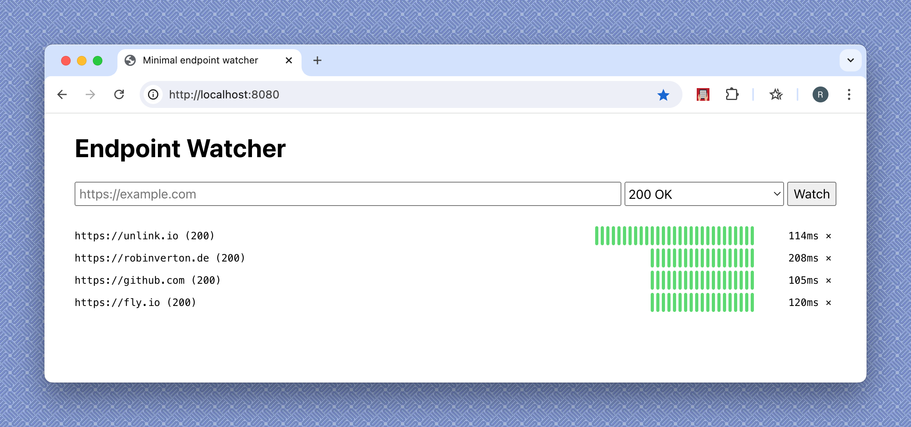

# Minimal Endpoint Watcher

Simple web app I use for monitoring personal and customer web pages by response
status.

Technologies used:
* [Echo](https://echo.labstack.com/) web framework
* sqlite
* [sqlc](https://sqlc.dev/) for type-safe SQL
* [templ](https://templ.guide/) for type-safe templating 
* [fly.io](https://fly.io/) for hosting
* postmark for mail notifications on resp status change



## Usage

Development:

```
make generate/sqlc
make generate/templ
make watch
make run
```

Deployment:

Dont forget to adjust `fly.toml`.

```
fly secrets set POSTMARK_TOKEN=xxx
fly secrets set PASS=http-basic-auth-pass
fly launch
```
